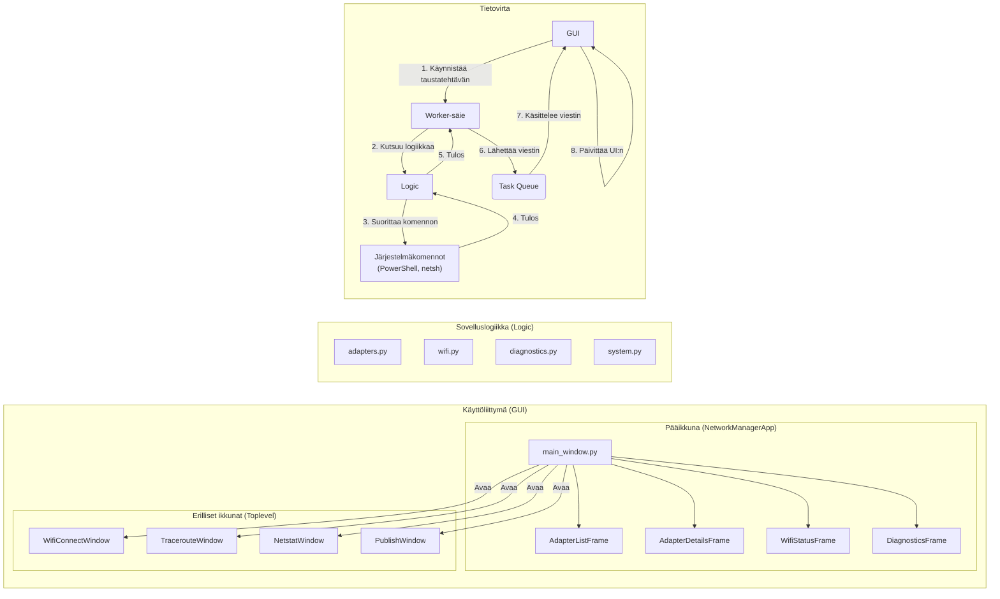

# NetPilot - Sovelluksen Arkkitehtuuri

Tämä dokumentti kuvaa NetPilot-sovelluksen arkkitehtuurin, sen pääkomponentit ja niiden väliset tietovirrat. Arkkitehtuuri on suunniteltu modulaariseksi ja vankaksi, erottaen selkeästi käyttöliittymän, tilanhallinnan ja järjestelmätason toiminnot.

## Yleiskatsaus

NetPilot noudattaa modernia työpöytäsovelluksen arkkitehtuuria, jossa on seuraavat pääperiaatteet:

1.  **Yksisuuntainen tietovirta:** Taustalla suoritettavat toiminnot eivät koskaan muokkaa käyttöliittymää suoraan. Sen sijaan ne lähettävät viestejä keskitettyyn jonoon, josta käyttöliittymä ne käsittelee turvallisesti.
2.  **Vastuun eriyttäminen (Separation of Concerns):**
    *   **GUI-kerros (`gui/`)**: Vastaa vain siitä, miltä sovellus näyttää ja käyttäjän syötteiden vastaanottamisesta.
    *   **Ohjain- ja hallintakerros (`gui/`):** Sisältää luokkia, jotka orkestroivat toimintoja ja hallinnoivat sovelluksen tilaa (`AppContext`, `MainController`, `ActionHandler`, `PollingManager`).
    *   **Logiikkakerros (`logic/`)**: Sisältää kaiken "likaisen työn", kuten järjestelmäkomentojen ja PowerShell-skriptien ajamisen.
3.  **Asynkroninen suoritus:** Hitaat verkkotoiminnot suoritetaan aina taustasäikeissä, jotta käyttöliittymä pysyy jatkuvasti reagoivana.

## Arkkitehtuurikaavio (Mermaid)

```mermaid
NetPilot/
├── gui/
│   ├── main_window.py      # Pääikkuna (tk.Tk)
│   ├── app_context.py      # Sovelluksen keskitetty tilanhallinta
│   ├── main_controller.py  # Käyttöliittymän valintojen ja datan hallinta
│   ├── action_handler.py   # Käyttäjän toimintojen logiikan orkestrointi
│   ├── queue_handler.py    # Taustasäikeiden ja UI:n välisen jonon käsittely
│   ├── polling_manager.py  # Taustalla tapahtuva säännöllinen datan haku
│   └── ...                 # Muut UI-komponentit ja ikkunat
├── logic/
│   ├── adapters.py         # Verkkosovittimien hallintalogiikka
│   ├── diagnostics.py      # Diagnostiikkatyökalujen logiikka
│   ├── wifi.py             # Wi-Fi-verkkojen ja profiilien hallinta
│   └── system.py           # Järjestelmätason toiminnot (admin, ipconfig, jne.)
├── logs/                   # (Luodaan ajon aikana)
│   └── app.log             # Lokitiedosto
├── main.py                 # Sovelluksen käynnistystiedosto (entry point)
├── logger_setup.py         # Lokituksen konfigurointi
├── build.py                # Skripti .exe-paketin rakentamiseen
├── README.md               # Projektin päädokumentaatio
└── ARCHITECTURE.md         # Tämä tiedosto
```

## Tärkeimmät Komponentit

1.  **`main.py` (Käynnistyspiste)**
    *   Vastaa sovelluksen käynnistämisestä.
    *   Alustaa lokituksen kutsumalla `logger_setup.py`:tä.
    *   Suorittaa esitarkastukset (ns. "pre-flight checks"):
        *   Varmistaa, että sovellus ajetaan Windows-ympäristössä.
        *   Tarkistaa ylläpitäjän oikeudet (`logic/system.py`).
    *   Jos tarkistukset menevät läpi, luo ja käynnistää pääikkunan (`gui/main_window.py`).
    *   Käsittelee ylimmän tason poikkeukset ja kirjaa kriittiset virheet.

2.  **`gui/main_window.py` (Käyttöliittymä)**
    *   Sisältää `NetworkManagerApp`-luokan, joka periytyy `tk.Tk`:sta ja toimii sovelluksen juuri-ikkunana.
    *   Rakentaa koko graafisen käyttöliittymän: välilehdet, painikkeet, tekstikentät ja muut elementit.
    *   Käynnistää `AppContext`-olion ja delegoi sille suurimman osan toimintalogiikasta.
    *   Käsittelee käyttöliittymän päivitysjonoa (`_process_queue`).

3.  **`gui/app_context.py` ja muut hallintaluokat**
    *   `AppContext` on sovelluksen "aivot", joka omistaa ja alustaa muut hallintakomponentit.
    *   `MainController` hallinnoi sovelluksen dataa (esim. sovitinlista) ja käyttäjän valintoja.
    *   `ActionHandler` ottaa vastaan käyttöliittymän tapahtumia (esim. napin painallus) ja käynnistää niihin liittyvät taustatehtävät.
    *   `QueueHandler` käsittelee taustatehtävien tulokset ja päivittää käyttöliittymää turvallisesti.
    *   `PollingManager` vastaa säännöllisestä datan (diagnostiikka, nopeudet) hakemisesta taustalla.

4.  **`logic/` (Sovelluslogiikka)**
    *   Tämä paketti sisältää kaiken "likaisen työn". Moduulit, kuten `adapters.py`, `wifi.py` ja `diagnostics.py`, sisältävät funktioita, jotka suorittavat järjestelmäkomentoja (`netsh`, `PowerShell`, `ipconfig`) ja palauttavat jäsenneltyä dataa.
    *   Tämä kerros ei tiedä mitään käyttöliittymästä, mikä tekee siitä uudelleenkäytettävän ja helposti testattavan.

5.  **`logger_setup.py` (Lokitus)**
    *   Konfiguroi keskitetyn `logging`-moduulin, joka kirjoittaa tapahtumat sekä konsoliin että `logs/debug.log`-tiedostoon. Tämä on tärkeää vianjäljityksen kannalta.

## Toimintalogiikka (Data Flow)

1.  Käyttäjä käynnistää `main.py`:n.
2.  Esitarkastukset suoritetaan. Virhetilanteessa näytetään `messagebox` ja sovellus suljetaan.
3.  `NetworkManagerApp`-olio luodaan, ja se rakentaa käyttöliittymän.
4.  Käyttäjä tekee toiminnon, esim. painaa "Poista käytöstä" -nappia.
5.  `AdapterDetailsFrame`:n tapahtumankäsittelijä kutsuu `ActionHandler`-luokan metodia (esim. `toggle_adapter`).
6.  `ActionHandler` käynnistää taustasäikeen, joka kutsuu `logic`-kerroksen funktiota (esim. `set_network_adapter_status_windows`).
7.  `logic`-funktio suorittaa järjestelmäkomennon. Tulos palautetaan taustasäikeelle.
8.  Taustasäie laittaa tuloksen sisältävän viestin (`dict`) keskitettyyn jonoon (`task_queue`).
9.  `main_window.py`:n `_process_queue`-metodi lukee jonon ja antaa viestin `QueueHandler`-oliolle.
10. `QueueHandler` tulkitsee viestin ja päivittää käyttöliittymän komponentteja (esim. `adapter_list.populate(...)` tai `status_var.set(...)`).

## Arkkitehtuurikaavio (Mermaid)

