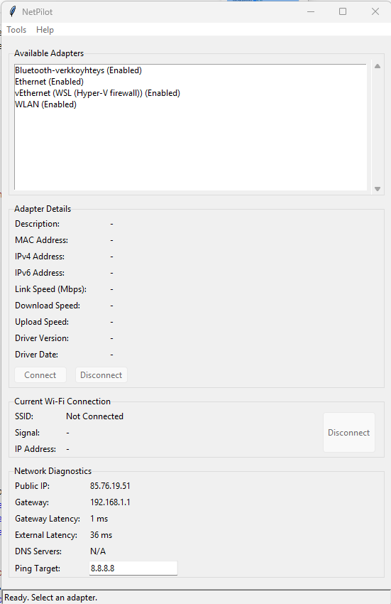

# NetPilot

[](https://opensource.org/licenses/MIT)

**NetPilot** on monipuolinen verkonhallinta- ja diagnostiikkatyökalu Windows-käyttöjärjestelmille. Se tarjoaa graafisen käyttöliittymän yleisimpiin verkon vianmääritys- ja hallintatehtäviin, jotka vaativat normaalisti komentorivin käyttöä.



## Sisällysluettelo

- [Ominaisuudet](#ominaisuudet)
- [Asennus ja käyttö](#asennus-ja-käyttö)
- [Vaatimukset](#vaatimukset)
- [Kehitys](#kehitys)
- [Kehitysprosessi ja Tekoälyn Rooli](#kehitysprosessi-ja-tekoälyn-rooli)
- [Osallistuminen (Contributing)](#osallistuminen-contributing)
- [Lisenssi](#lisenssi)

## Ominaisuudet

*   **Verkkosovittimien hallinta:** Ota käyttöön (Enable) ja poista käytöstä (Disable) verkkosovittimia helposti.
*   **Yksityiskohtaiset tiedot:** Näe sovittimien tiedot, kuten IP- ja MAC-osoitteet, nopeudet ja ajuritiedot.
*   **Wi-Fi-työkalut:**
    *   Selaa ja yhdistä saatavilla oleviin Wi-Fi-verkkoihin.
    *   Tarkastele ja poista tallennettuja Wi-Fi-profiileja.
    *   Kopioi tallennettujen verkkojen salasanat leikepöydälle.
    *   Vie profiilit ja salasanat tekstitiedostoon.
*   **Diagnostiikka:**
    *   Seuraa reaaliaikaisesti lataus- ja lähetysnopeuksia.
    *   Tarkista julkinen IP-osoite, yhdyskäytävän ja ulkoisen palvelimen viiveet.
    *   Suorita `tracert` ja `netstat` graafisessa näkymässä.
*   **Verkon ylläpito:**
    *   Tyhjennä DNS-välimuisti (`ipconfig /flushdns`).
    *   Uusi IP-osoite (`ipconfig /release` & `/renew`).
    *   Nollaa verkkopino (`netsh winsock reset`).

## Asennus ja käyttö

### Valmis sovellus (.exe)

1.  Lataa uusin `NetPilot.exe` projektin Releases-sivulta (linkki lisätään myöhemmin).
2.  Käynnistä ladattu tiedosto. Asennusta ei vaadita.

> **Huom!** Ohjelma vaatii **ylläpitäjän oikeudet** toimiakseen oikein, koska se muokkaa verkkosovittimien asetuksia.

### Lähdekoodista suorittaminen

1.  Kloonaa tämä repositorio: `git clone https://github.com/atkeppu/NetPilot.git`
2.  Siirry projektihakemistoon: `cd NetPilot`
3.  Käynnistä pääskripti ylläpitäjän oikeuksin: `python main.py`
    *   Sovelluksella ei ole ulkoisia ajonaikaisia riippuvuuksia.

## Vaatimukset

*   Windows 10 tai uudempi.
*   Python 3.10+ (jos suoritetaan lähdekoodista).
*   GitHub CLI (jos käytät `git_helper.py`-skriptiä).

## Kehitys

Tämä osio on tarkoitettu kehittäjille, jotka haluavat muokata koodia tai rakentaa ohjelman itse.

### Kehitysympäristön pystyttäminen

1.  Varmista, että sinulla on Python 3.10+ asennettuna.
2.  Kloonaa repositorio ja siirry sen juurihakemistoon.
3.  (Suositus) Luo ja aktivoi virtuaaliympäristö:
    ```bash
    python -m venv venv
    .\venv\Scripts\activate
    ```
4.  Asenna kehityksessä tarvittavat riippuvuudet:
    ```bash
    pip install -r requirements-dev.txt
    ```

### Sovelluksen rakentaminen (.exe)

Voit paketoida sovelluksen yhdeksi `.exe`-tiedostoksi `build.py`-skriptillä.
1.  Varmista, että olet asentanut kehitysriippuvuudet (katso yllä).
2.  Suorita build-skripti:
    ```bash
    python build.py
    ```
3.  Valmis `NetPilot.exe`-tiedosto löytyy `dist`-kansiosta.

### Arkkitehtuurikaavioiden tarkastelu

`ARCHITECTURE.md`-tiedosto sisältää Mermaid-syntaksilla luotuja kaavioita, jotka visualisoivat sovelluksen rakennetta. Nämä kaaviot eivät välttämättä näy oikein kaikissa Markdown-katseluohjelmissa.

**Suositus:** Käytä editoria, joka tukee Mermaid-laajennuksia. Esimerkiksi:

*   **Visual Studio Code:** Asenna laajennus `Markdown Preview Mermaid Support`. Tämän jälkeen kaaviot näkyvät oikein, kun avaat `.md`-tiedoston esikatselun (esim. `Ctrl+Shift+V`).
*   **GitHub:** Mermaid-kaaviot renderöityvät automaattisesti, kun ne ovat ````mermaid` koodilohkojen sisällä, kuten `ARCHITECTURE.md`-tiedostossa on tehty.

### Kehittäjän aputyökalut

`git_helper.py`-skripti on apuväline, joka automatisoi uuden GitHub-projektin luomisen ja olemassa olevan koodin lähettämisen sinne. Tämä on hyödyllistä, kun aloitat uuden projektin paikallisesti ja haluat julkaista sen GitHubiin vaivattomasti.

**Esimerkkikäyttö:**

```bash
# Luo uusi julkinen projekti nimeltä "NetPilot" GitHubiin
python git_helper.py NetPilot -d "Projektin kuvaus tähän"
```

## Kehitysprosessi ja Tekoälyn Rooli

Tämä projekti on kehitetty hyödyntäen laajasti tekoälyavusteisia työkaluja, kuten Gemini Code Assistia. Tekoälyä on käytetty monissa kehitysvaiheissa:

*   **Koodin generointi:** Rutiininomaisten funktioiden ja koodirakenteiden luominen.
*   **Refaktorointi:** Koodin laadun ja luettavuuden parantaminen.
*   **Virheenkorjaus:** Ongelmien tunnistaminen ja korjausehdotusten saaminen.
*   **Dokumentaatio:** Kommenttien, `README`-tiedoston ja muiden selittävien tekstien kirjoittaminen.
*   **Testaus:** Yksikkötestien luominen ja testauksen suunnittelu.

Tekoälyn käyttö on nopeuttanut kehitystä merkittävästi ja auttanut ylläpitämään korkeaa koodin laatua.

## Osallistuminen (Contributing)

Apu projektin kehittämisessä on tervetullutta! Jos haluat osallistua, voit tehdä sen seuraavilla tavoilla:

1.  **Ilmoita bugeista:** Jos löydät virheen, luo uusi Issue ja kuvaile ongelma mahdollisimman tarkasti.
2.  **Ehdota parannuksia:** Onko sinulla idea uudesta ominaisuudesta tai parannuksesta? Avaa Issue ja kerro siitä.
3.  **Lähetä Pull Request:** Jos olet korjannut bugin tai toteuttanut uuden ominaisuuden, voit lähettää Pull Requestin.

## Lisenssi

Tämä projekti on lisensoitu MIT-lisenssillä. Tämä tarkoittaa, että voit vapaasti käyttää, kopioida, muokata ja jakaa koodia, kunhan alkuperäinen lisenssi ja tekijänoikeusilmoitus säilytetään.
```